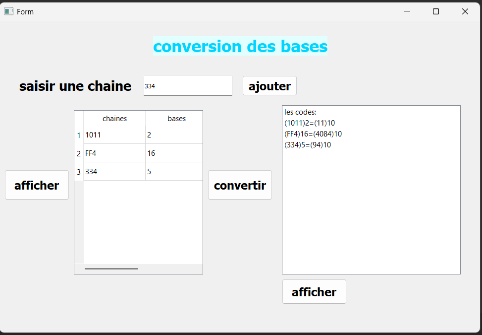

# Base Conversion App

## Description
Python PyQt5 GUI application to input strings in different bases, convert them to decimal, and display results.

## Features
- Add strings with their base (2-16)
- Display input data in a table
- Convert strings to decimal numbers
- Display converted numbers in a list

## Files
- `conversion.py` : main Python script
- `nb_base.dat` : stores input strings and their base
- `nombres.txt` : stores converted numbers
- `interface_base.ui` : PyQt5 interface
- `images/conversion/` : screenshots of the application

## Screenshots

### Adding Input

